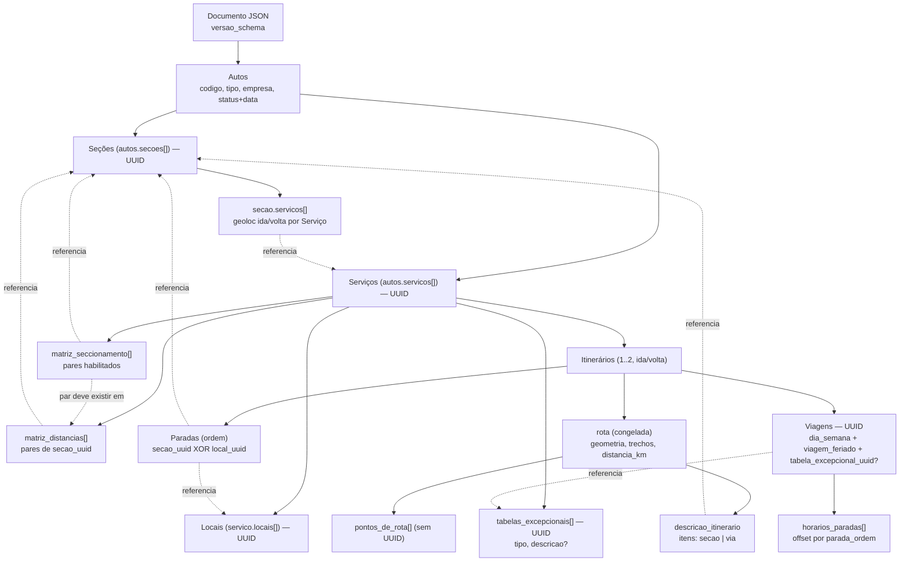
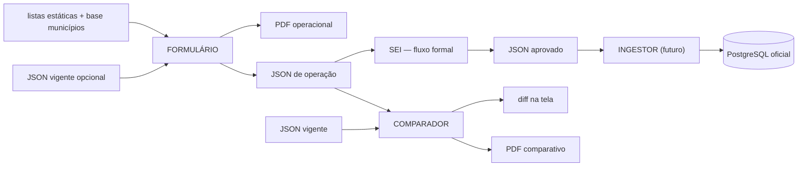

# 02 — DOMAIN_MODEL: Modelo de Domínio do ROTA

**Fonte:** Specs 01–05. Regras normativas em `01-RULE_INDEX.md` (RN-xxx). Este documento é descritivo — em divergência, a spec vence.

---

## Autos de Linha

**Definição:** Identificador regulatório principal (código `"0000"`) que agrupa um ou mais Serviços sob o mesmo processo administrativo. No JSON é o objeto `autos` (raiz de tudo). (Spec 01 §4; Spec 02 §4)
**Pertence a:** Documento (raiz).
**Pode referenciar:** Tipo de Autos, Empresa (valores das listas estáticas).
**Pode ser referenciado por:** — (é o topo da árvore).
**Tem UUID estável?** Não — a identidade é o `codigo` regulatório (o Comparador exige o mesmo `codigo` nos dois arquivos, RN-084).
**Entra no JSON?** Sim (`autos`).
**Entra no PDF?** Sim (capa/identificação).
**Participa de tarifa?** Indiretamente (o tipo condiciona características; as Seções dele definem tarifa).
**Participa de rota?** Não diretamente.
**Observações de implementação:** o Autos já existe administrativamente — o Formulário nunca "cria linha nova", só documenta a operação de um Autos das listas estáticas (RN-016).

## Tipo de Autos

**Definição:** Classificação em `Semiurbano` | `Semiurbano Litorâneo` | `Rodoviário` | `Rodoviário Litorâneo`. Fixa a família de característica de veículo e as regras de variação (Spec 01 §7; Spec 03 §10).
**Pertence a:** Autos (`autos.tipo`).
**Pode ser referenciado por:** validação de tipificação de cada Serviço.
**Tem UUID estável?** Não (enum).
**Entra no JSON?** Sim. **Entra no PDF?** Sim. **Participa de tarifa?** Não. **Participa de rota?** Não.
**Observações de implementação:** o `tipo` é editável a qualquer momento; ao trocá-lo, Serviços com `caracteristica_veiculo` incompatível são reconvertidos para a forma convencional (padrão) do tipo, com aviso — nunca bloqueia (RN-023, DEC-034).

## Empresa

**Definição:** Permissionária do Autos (`autos.empresa`, string das listas estáticas).
**Pertence a:** Autos. **Tem UUID estável?** Não. **Entra no JSON?** Sim. **Entra no PDF?** Sim. **Participa de tarifa/rota?** Não.
**Observações:** empresa fora das listas atuais bloqueia o carregamento do JSON (RN-017).

## Serviço

**Definição:** Variação operacional dentro de um Autos — combinação de itinerário (caráter) e característica de veículo. Rótulo humano `numero_n` (`0000-NXX`); identidade por `uuid` (Spec 01 §4; Spec 02 §6).
**Pertence a:** Autos (`autos.servicos[]`).
**Pode referenciar:** Seções (via Paradas e matrizes), Característica de veículo, Caráter.
**Pode ser referenciado por:** `secao.servicos[].servico_uuid`.
**Tem UUID estável?** **Sim** (RN-001).
**Entra no JSON?** Sim. **Entra no PDF?** Sim (bloco por Serviço).
**Participa de tarifa?** Sim — dono de `matriz_distancias` e `matriz_seccionamento`.
**Participa de rota?** Sim — dono dos itinerários.
**Observações de implementação:** contém `locais[]`, `matriz_distancias[]`, `matriz_seccionamento[]`, `itinerarios[]`. Duplicar Serviço = UUIDs novas para tudo que é copiado (RN-007). `numero_n` nunca é chave (RN-006).

## Característica de veículo

**Definição:** Código do tipo de veículo, em duas famílias: semiurbana (`SU`, `SUL`) e rodoviária (`CR`, `CL`, `EX`, `LE` + mistos `ME`, `MEL`, `ML`, `MLL`, `MX`, `MM`, `MML`). Não existe `SL`/Semileito (Spec 01 §7; Spec 03 §10 v0.5). Mistos com componente convencional têm códigos distintos por litoralidade (`ME`×`MEL`, `ML`×`MLL`, `MM`×`MML`); `EX`, `LE` e `MX` valem nos dois tipos rodoviários (executivo e leito não têm forma litorânea).
**Pertence a:** Serviço (`caracteristica_veiculo`).
**Tem UUID estável?** Não (enum). **Entra no JSON?** Sim. **Entra no PDF?** Sim. **Participa de tarifa/rota?** Não.
**Observações:** o dropdown do Formulário já vem filtrado pela tabela de tipificação (Spec 04 §6; RN-019..022).

## Seção

**Definição:** Ponto físico georreferenciado que **define tarifa** e participa do seccionamento. Entidade do **Autos**, compartilhada por todos os Serviços que passam por ali; cada Serviço contribui suas geolocalizações Ida/Volta (Spec 02 §5).
**Pertence a:** Autos (`autos.secoes[]`).
**Pode referenciar:** Serviços (entradas `servicos[].servico_uuid`).
**Pode ser referenciado por:** Paradas (`secao_uuid`), `matriz_distancias`, `matriz_seccionamento`, `descricao_itinerario.itens`.
**Tem UUID estável?** **Sim.**
**Entra no JSON?** Sim. **Entra no PDF?** Sim (tabelas, matrizes, descrição, sequência com setas).
**Participa de tarifa?** **Sim** (é a unidade tarifária).
**Participa de rota?** Sim (é parada; sua geolocalização entra no roteamento).
**Observações de implementação:** cluster de pontos sob a regra dos 350 m por centroide cumulativo (RN-027); `municipio` derivado do centroide (RN-029); exibição sempre `Cidade - Nome da Seção`.

## Local

**Definição:** Ponto físico georreferenciado **sem** relevância tarifária (embarque/desembarque comum), usado pelos itinerários de **um** Serviço (Spec 02 §7).
**Pertence a:** Serviço (`servico.locais[]`).
**Pode ser referenciado por:** Paradas (`local_uuid`) do mesmo Serviço.
**Tem UUID estável?** **Sim** (única no documento inteiro, mesmo sem compartilhamento — RN-005).
**Entra no JSON?** Sim. **Entra no PDF?** **Depende** — só no anexo técnico, sem horários (RN-076).
**Participa de tarifa?** **Não.**
**Participa de rota?** Sim (é parada intermediária; seus trechos são somados nas distâncias entre Seções — RN-055).
**Observações de implementação:** regra dos 350 m **pareada** Ida×Volta (RN-032); nunca aparece na grade principal, na descrição textual nem na matriz.

## Parada

**Definição:** Ocorrência de uma Seção **ou** de um Local no itinerário, com posição (`ordem`). Referência, não entidade (Spec 02 §10.1).
**Pertence a:** Itinerário (`itinerario.paradas[]`).
**Pode referenciar:** exatamente um de Seção (`secao_uuid`) XOR Local (`local_uuid`) — RN-033.
**Pode ser referenciado por:** `rota.trechos` (por `ordem`), `viagem.horarios_paradas` (por `parada_ordem`), `pontos_de_rota` (`apos_parada_ordem`).
**Tem UUID estável?** **Não** — casa-se no Comparador pelo contexto (itinerário + entidade referenciada, RN-082).
**Entra no JSON?** Sim. **Entra no PDF?** Depende (Seções sim; Locais só anexo).
**Participa de tarifa?** Depende (só se referencia Seção). **Participa de rota?** Sim.
**Observações:** extremos sempre Seção (RN-035); não carrega horário (RN-037).

## Itinerário

**Definição:** Sequência ordenada de paradas de um Serviço num sentido (Ida/Volta), com rota georreferenciada e descrição textual por vias (Spec 01 §4; Spec 02 §10).
**Pertence a:** Serviço (`servico.itinerarios[]`, 1 ou 2).
**Pode referenciar:** Paradas → Seções/Locais.
**Pode ser referenciado por:** Viagens (contidas nele).
**Tem UUID estável?** Não — casa por `servico_uuid` + `sentido` (RN-082).
**Entra no JSON?** Sim. **Entra no PDF?** Sim (item 4 da estrutura).
**Participa de tarifa?** Indiretamente (seus trechos alimentam `matriz_distancias`).
**Participa de rota?** Sim (é o dono da `rota`).

## Rota

**Definição:** Objeto `rota` do itinerário: `geometria` street-snapped (OSRM), `distancia_km`, `duracao_s`, `trechos[]`, `pontos_de_rota[]`, `descricao_itinerario`. Computada no Formulário e **congelada** (Spec 02 §10.2).
**Pertence a:** Itinerário.
**Tem UUID estável?** Não.
**Entra no JSON?** Sim. **Entra no PDF?** Sim (imagem do mapa + distância).
**Participa de tarifa?** Sim — a distância roteada alimenta a tarifa (por isso OSRM indisponível bloqueia, RN-048).
**Participa de rota?** É a rota.
**Observações de implementação:** leitores nunca recalculam (RN-015); comparada por sinais estáveis, não byte-a-byte (RN-087).

## Ponto de rota

**Definição:** Vértice arrastável que **força o traçado** da rota por determinada via. Não é Seção, Local nem Parada; propósito único (Spec 02 §10.4; Spec 03 §3.6).
**Pertence a:** Rota (`rota.pontos_de_rota[]`), ancorado a um trecho via `apos_parada_ordem`.
**Tem UUID estável?** **Não** (não é entidade comparável).
**Entra no JSON?** Sim — só para reproduzir a rota forçada na reedição.
**Entra no PDF?** Não (efeito já está na geometria; alterações aparecem no anexo do PDF comparativo pelo efeito).
**Participa de tarifa?** Indiretamente (muda a distância roteada — desejado, RN-043). **Participa de rota?** Sim (condiciona).
**Observações:** nunca vira trecho/parada (RN-041/042); Comparador o compara pelo efeito observável.

## Matriz de distâncias

**Definição:** `servico.matriz_distancias[]` — distância entre **cada par** de Seções atendidas pelo Serviço (`distancia_trecho_ida?`, `distancia_trecho_volta?`, `valor_adotado_de_distancia`), computada por soma de trechos e congelada (Spec 02 §8; Spec 03 §4–5).
**Pertence a:** Serviço (intra-Serviço, RN-054).
**Pode referenciar:** pares de `secao_uuid`.
**Pode ser referenciado por:** `matriz_seccionamento` (todo par habilitado deve existir aqui).
**Tem UUID estável?** Não (par casado por `{secao_a, secao_b}`).
**Entra no JSON?** Sim. **Entra no PDF?** Sim (triangular inferior, km).
**Participa de tarifa?** Sim (é a base de distância). **Participa de rota?** Deriva dela.

## Matriz de seccionamento

**Definição:** `servico.matriz_seccionamento[]` — pares de Seções habilitados para venda de passagem parcial, com `distancia_km` de referência **confirmada pelo usuário** (Spec 02 §9).
**Pertence a:** Serviço.
**Pode referenciar:** pares de `secao_uuid` presentes na `matriz_distancias` do mesmo Serviço (RN-059).
**Tem UUID estável?** Não.
**Entra no JSON?** Sim (default `[]`). **Entra no PDF?** Sim ("—" nos não habilitados).
**Participa de tarifa?** **Sim** — é a "matriz tarifária" (em km; R$ é externo, RN-013).
**Observações:** alimenta `pares_compraveis` junto com o par ponta-a-ponta (RN-072).

## Tabela excepcional

**Definição:** Grade de operação excepcional de um Serviço — categoria **textual**, não datada: `{ uuid, tipo, descricao? }`, `tipo ∈ {ferias_verao, ferias_inverno, personalizado}`, `descricao` só para `personalizado` (Spec 02 §6.1; DEC-081).
**Pertence a:** Serviço (`servico.tabelas_excepcionais[]`).
**Pode referenciar:** — (é referenciada pelas Viagens via `tabela_excepcional_uuid`).
**Tem UUID estável?** **Sim** (preservada na importação; chave que a Viagem referencia).
**Entra no JSON?** Sim. **Entra no PDF?** Sim (grade própria, tabela separada como a de feriados).
**Observações:** canônicas (`ferias_verao`/`ferias_inverno`) únicas por Serviço, `personalizado` repetível; sem verificação de sobreposição; em feriado a operação de feriado prevalece (não tem sub-grade de feriado própria); Viagens excepcionais não entram nas contagens da semana padrão (RN-098/099).

## Viagem

**Definição:** Uma partida de um itinerário em **um único** `dia_semana`, em **exatamente uma** grade — comum (`viagem_feriado=false`, `tabela_excepcional_uuid=null`), de feriado (`viagem_feriado=true`) ou de uma **tabela excepcional** (`tabela_excepcional_uuid ≠ null`, que implica `viagem_feriado=false`) — com `horario_saida` e offsets próprios (Spec 02 §11; DEC-081).
**Pertence a:** Itinerário (`itinerario.viagens[]`).
**Pode referenciar:** Paradas (via `horarios_paradas[].parada_ordem`); uma Tabela excepcional do Serviço-pai (via `tabela_excepcional_uuid`).
**Tem UUID estável?** **Sim.**
**Entra no JSON?** Sim. **Entra no PDF?** Sim (grade de horários; feriados e cada grade excepcional em tabelas separadas).
**Participa de tarifa?** Não diretamente (entra na contagem de opções, só a grade comum). **Participa de rota?** Não (usa a do itinerário).
**Observações:** célula preenchida da grade = uma Viagem; cópias **aditivas** geram UUID nova, enquanto a semeadura entre grades (`Copiar (sobrescrever)`) preserva a UUID da Viagem casada no destino (RN-007; DEC-099); reforço de horário é válido (RN-062).

## Horários de passagem

**Definição:** `viagem.horarios_paradas[]` — um `offset_horario` (`HH:MM:SS`, desde `horario_saida`) por Parada do itinerário; primeiro `00:00:00`, não decrescentes (Spec 02 §11.1).
**Pertence a:** Viagem.
**Tem UUID estável?** Não (casa por Viagem + `parada_ordem`).
**Entra no JSON?** Sim. **Entra no PDF?** Como horários **absolutos** por Seção (nunca offsets — RN-067/076).
**Observações:** sugestão inicial por acúmulo de durações (RN-064); redistribuição proporcional entre âncoras (RN-065); reset (RN-066).

## JSON de operação

**Definição:** O artefato-contrato: fotografia completa e autossuficiente da operação de **um** Autos (Spec 01 §5; Spec 02).
**Pertence a:** — (é o documento).
**Tem UUID estável?** O documento não; suas entidades sim.
**Entra no PDF?** É a fonte dele.
**Participa de tarifa?** Carrega as distâncias que a alimentam; **nunca** R$ (RN-013).
**Observações de implementação:** só operação (RN-010); autossuficiente (RN-009); exportar = salvar (RN-096); contrato único entre as três ferramentas (RN-097); `versao_schema` na raiz (RN-008).

## PDF operacional

**Definição:** Documento do **Formulário** que apresenta a operação do Autos — tabela operacional legível (fiscal, motorista, passageiro) (Spec 04 §13).
**Pertence a:** Formulário (gerado client-side).
**Entra no JSON?** Não (artefato separado).
**Observações:** estrutura fixa (RN-074); duas versões da tabela horária (RN-075); sem R$/offsets, aviso SEI (RN-076/077).

## JSON vigente

**Definição:** JSON com `status:"vigente"` + `data_publicacao` (manual) — baseline da operação em vigor, tipicamente gerado após aprovação no SEI (Spec 02 §4.1; Spec 04 §12.2).
**Observações:** "definir como vigente" é ação técnica, **não** aprovação (RN-079); serve de Arquivo 1 típico do Comparador e de entrada opcional de pré-preenchimento do Formulário.

## JSON proposta

**Definição:** JSON com `status:"proposta"` + `data_criacao` (automática) — a operação proposta pela empresa, a peticionar no SEI (Spec 02 §4.1; Spec 04 §12.1).
**Observações:** deve nascer, sempre que possível, do carregamento do vigente (preservação de UUID, RN-004); criado do zero gera alerta no Comparador (RN-086).

## Comparador

**Definição:** Segunda ferramenta do ROTA: recebe dois JSONs, casa entidades por UUID, mostra diff e gera PDF comparativo (Spec 05).
**Entra no JSON?** Nunca escreve nele — somente-leitura (RN-080).
**Observações:** taxonomia fixa (RN-083); bloqueio de Autos diferentes (RN-084); não chama OSRM, não persiste nada.

## Ingestor

**Definição:** Terceira ferramenta (futura, Spec 06 pendente): lê o JSON aprovado e materializa no PostgreSQL oficial, com UUID como chave (Spec 01 §2; RN-093/094).
**Observações:** não faz parte do MVP; nada no Formulário/Comparador pode depender dele.

## SEI

**Definição:** Sistema externo onde ocorre **toda** a gestão formal: quem pediu, pendências, manifestações, aprovação, publicação, vigência real, arquivamento (Spec 01 §1, §3).
**Entra no JSON?** **Não** — nenhum dado do SEI entra no ROTA (exceção estreita: RN-011).
**Observações:** o ROTA gera os artefatos (PDF + JSON) que são **peticionados** no SEI; o ROTA nunca replica funções dele (RN-095).

---

# Relações principais

Fluxo entre ferramentas (Spec 01 §2):

---

# Coisas que parecem iguais, mas não são

| Par | Diferença essencial |
|---|---|
| **Seção vs Local** | Seção define **tarifa**, pertence ao **Autos** e é **compartilhada** entre Serviços (cluster de pontos, 350 m por centroide). Local não tem tarifa, pertence a **um** Serviço, não é compartilhado (350 m pareado Ida×Volta). Local nunca entra em matriz, grade principal ou descrição textual. Não existe "promover Local a Seção" automático. |
| **Local vs Parada** | Local é a **entidade** física (nome, município, geolocalizações). Parada é a **ocorrência** de uma Seção ou Local dentro de um itinerário, com `ordem`. Parada não tem UUID nem coordenada própria — só referencia. |
| **Parada vs Ponto de rota** | Parada é atendimento (o ônibus para; gera trecho e horário). Ponto de rota só **condiciona o traçado** — sem UUID, sem nome, sem tarifa, sem horário, sem trecho; existe apenas para reproduzir a rota forçada. Ponto de rota **nunca** vira parada (NEG). |
| **Serviço vs Autos** | Autos é o agrupador regulatório (código, tipo, empresa). Serviço é a variação operacional dentro dele (característica de veículo, caráter, itinerários próprios, matrizes próprias). Tarifa e rota são por **Serviço**; identidade regulatória é por **Autos**. |
| **JSON vigente vs JSON proposta** | Mesmo schema; muda a autodeclaração: `vigente` + `data_publicacao` (manual) é a baseline publicada; `proposta` + `data_criacao` (automática) é o que se peticiona. `status`/datas ficam **fora do diff** (RN-012). Não é workflow. |
| **PDF operacional vs PDF comparativo** | O operacional (Formulário) apresenta **uma** operação. O comparativo (Comparador) apresenta as **diferenças entre duas versões** (`antigo → novo (Δ)`), com estrutura própria. Nunca misturar nem reaproveitar um pelo outro. |
| **ROTA vs SEI** | ROTA = dados de operação e artefatos técnicos (JSON, PDFs). SEI = gestão do processo (status, pendência, aprovação, publicação, histórico). O ROTA não conhece status de pedido; a exceção `autos.status` é etiqueta de arquivo, não ciclo de vida. |
| **UUID vs número/rótulo humano** | `uuid` é identidade de máquina — estável, preservada na importação, base do diff e chave futura no banco. `numero_n`, `nome`, rótulos são display — mutáveis e reaproveitáveis, proibidos como chave (RN-006). |
| **Matriz de distâncias vs matriz de seccionamento** | Distâncias: **computada** (soma de trechos), congelada, cobre **todos** os pares, somente-leitura. Seccionamento: **decisão do usuário** — quais pares vendem passagem parcial e com que distância de referência (sugerida, mas confirmada manualmente); subconjunto dos pares da matriz de distâncias. |
| **`rota.trechos` vs `matriz_distancias`** | Trechos: granulares por **parada consecutiva** (incluem Locais), por sentido, com duração. Matriz: agregada por **par de Seções**, Ida e Volta juntas, sem duração. |
| **Viagem comum vs viagem de feriado vs excepcional** | Entidades distintas (UUIDs distintas), grades independentes e mutuamente exclusivas por Viagem (comum / feriado / tabela excepcional). Precedência **feriado > excepcional > comum**: no feriado a grade de feriados **substitui integralmente** a comum **e** a excepcional. Feriados e excepcionais **nunca** entram nas contagens (semana padrão = só a grade comum). Tabela excepcional é categoria **textual** (`ferias_verao`/`ferias_inverno`/`personalizado`), não datada (DEC-081). |
| **Distância Haversine vs distância roteada** | Haversine: linha reta, **só** para regras espaciais (350 m, deslocamento relatado no Comparador). Roteada (OSRM): a que alimenta trechos, matrizes e tarifa. Nunca usar uma no lugar da outra. |
