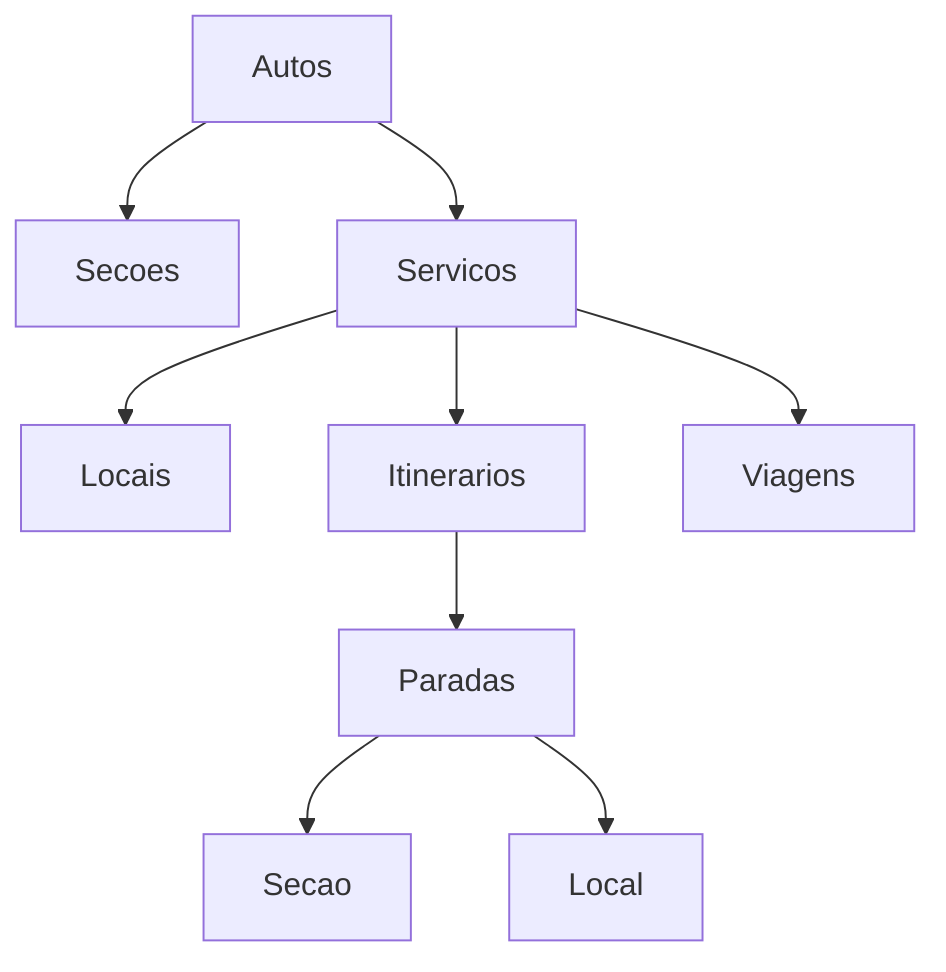

# PROMPT — Criar estrutura de Spec-Driven Development do projeto ROTA

Você vai atuar como **arquiteto de desenvolvimento orientado por especificações**, **engenheiro de harness para IA** e **organizador técnico do projeto**.

Este projeto já possui as specs de negócio prontas em arquivos `.md`.
Sua tarefa agora **não é implementar o app ainda**.
Sua tarefa é criar todos os documentos operacionais necessários para que o desenvolvimento do app seja feito de forma controlada, rastreável, testável e aderente às specs.

## Contexto do Projeto

O projeto se chama:

**ROTA — Registro de Operação e Tabelas de Autos**

É um WebApp para apoio à elaboração, verificação e comparação de tabelas operacionais de linhas de ônibus intermunicipais da ARTESP/SUCOL.

O sistema **não é um sistema de gestão de processo**.
Toda a gestão formal ocorre fora do ROTA, no SEI.

O ROTA é composto por três ferramentas desacopladas:

1. **Formulário**
   - Entrada estruturada de dados operacionais de um Autos.
   - Uso de mapa.
   - Validações de negócio.
   - Geração de PDF operacional.
   - Exportação de JSON de operação.
   - Importação opcional de JSON vigente/proposta para pré-preenchimento.
   - Não salva nada no servidor.

2. **Comparador**
   - Recebe dois JSONs: vigente e proposta.
   - Compara as versões.
   - Mostra diff visual.
   - Gera PDF comparativo próprio.
   - Não altera o JSON original.

3. **Ingestor**
   - Ferramenta futura.
   - Recebe JSON aprovado.
   - Materializa os dados em PostgreSQL oficial.
   - Não faz parte do fluxo inicial de aprovação.

O contrato central do sistema é o **JSON de operação**.

O JSON representa uma fotografia completa e autossuficiente da operação de um Autos, contendo:

- identificação do Autos;
- tipo;
- empresa;
- seções;
- serviços;
- locais;
- itinerários;
- paradas;
- rotas;
- pontos de rota;
- matriz de distâncias;
- matriz de seccionamento;
- viagens;
- horários.

O JSON **não deve conter**:

- status de pedido;
- workflow;
- aprovação;
- pendência;
- manifestação;
- auditoria;
- usuário responsável;
- histórico de análise;
- publicação em DOE;
- controle de vigência processual.

O sistema usa:

- Frontend React/Next.js;
- comportamento majoritariamente client-side;
- sem backend transacional no MVP;
- OSRM público para roteamento;
- geração client-side de JSON e PDF;
- PostgreSQL apenas no Ingestor futuro;
- listas estáticas de Autos, empresas e tipos.

## Objetivo da sua tarefa

Criar uma camada completa de **Spec-Driven Development com IA** para este projeto.

Você deve ler todas as specs `.md` disponíveis no repositório e gerar documentos que permitam:

1. rastrear regras de negócio;
2. transformar specs em tarefas pequenas;
3. orientar futuras IAs a implementar sem inventar regras;
4. padronizar critérios de aceite;
5. padronizar testes;
6. garantir aderência ao domínio;
7. evitar que o app vire um sistema de gestão de processo;
8. separar claramente Formulário, Comparador e Ingestor;
9. manter o JSON como contrato central;
10. preparar o projeto para implementação incremental.

## Regras obrigatórias para sua atuação

1. **Não implementar código do app agora.**
2. **Não criar componentes React, serviços, schemas ou testes automatizados ainda**, exceto se forem documentos ou exemplos conceituais.
3. **Não alterar as specs originais**, salvo se criar arquivos derivados ou apontar sugestões em documento separado.
4. **Não inventar regra de negócio.**
5. Quando uma regra estiver ambígua, registre como ambiguidade.
6. Quando houver conflito entre specs, registre como conflito.
7. Quando algo for inferência sua, marque explicitamente como inferência.
8. Use a nomenclatura oficial das specs.
9. Preserve a separação entre:
   - Formulário;
   - Comparador;
   - Ingestor;
   - SEI.

10. Não transformar o ROTA em sistema de workflow.
11. Não criar campos de status, aprovação, pendência ou histórico no JSON.
12. Tratar o JSON de operação como contrato central entre as ferramentas.
13. Considerar UUID estável como regra crítica para Seção, Serviço, Local e Viagem.
14. Considerar que importar JSON deve preservar UUIDs existentes.
15. Considerar que exportar JSON é o ato de “salvar” no Formulário.
16. Considerar que o Comparador compara entidades principalmente por UUID.
17. Considerar que OSRM público pode falhar e que a indisponibilidade deve bloquear a geração de rota inválida.
18. Considerar que distância roteada alimenta dados operacionais/tarifários, portanto rota não calculada não deve ser aceita como válida.
19. Considerar que pontos de rota são apenas condicionadores do traçado, não são Seção, Local nem Parada.
20. Considerar que Seção e Local são entidades diferentes.
21. Considerar que Seção pertence ao Autos e pode ser compartilhada por Serviços.
22. Considerar que Local pertence ao Serviço e não é compartilhado.
23. Considerar que Parada é ocorrência referenciando uma Seção OU um Local, nunca ambos e nunca nenhum.
24. Considerar que Viagem possui frequência semanal e regra binária de feriado.
25. Considerar que opção de deslocamento é estatística derivada, não entrada de usuário.

## Entregáveis esperados

Crie uma pasta de documentação operacional, por exemplo:

```text
/docs-dev/
```

Dentro dela, crie os seguintes arquivos.

---

# 1. `00-README-SPEC-DRIVEN.md`

Criar um documento explicando como o projeto será desenvolvido com base nas specs.

Deve conter:

- objetivo do spec-driven development neste projeto;
- papel das specs originais;
- papel dos documentos derivados;
- fluxo recomendado de trabalho;
- ordem de leitura;
- como criar tarefas;
- como implementar tarefas;
- como revisar aderência à spec;
- como lidar com ambiguidades;
- como lidar com conflitos;
- como decidir se algo pertence ao ROTA ou ao SEI;
- como garantir que o JSON continue sendo o contrato central.

O documento deve deixar claro que o fluxo correto é:

```text
Specs originais
→ índice de regras
→ matriz de rastreabilidade
→ backlog
→ task pequena
→ análise da IA
→ plano
→ implementação
→ testes
→ revisão de aderência
```

---

# 2. `01-RULE_INDEX.md`

Criar um índice consolidado de regras de negócio.

Leia todas as specs `.md` e extraia regras no formato:

```md
## RN-001 — Nome curto da regra

**Descrição:**  
...

**Origem:**

- Spec XX, seção YY

**Tipo:**

- Domínio | Validação | Cálculo | UI | JSON | Comparador | Ingestor | Arquitetura | PDF

**Criticidade:**

- Alta | Média | Baixa

**Afeta:**

- Formulário
- Comparador
- Ingestor
- JSON
- PDF
- Testes

**Critérios objetivos:**

- ...

**Exemplos válidos:**

- ...

**Exemplos inválidos:**

- ...

**Observações:**  
...
```

Requisitos:

- Cada regra deve ter ID único no formato `RN-001`, `RN-002`, `RN-003`.
- Não reutilizar IDs.
- Não criar regra que não esteja nas specs.
- Quando uma regra for derivada de mais de uma spec, citar todas as origens.
- Quando a regra estiver implícita, marcar como `Inferência controlada`.
- Quando houver dúvida, criar anotação `DÚVIDA`.
- Quando houver conflito, criar anotação `CONFLITO`.

Separar as regras por grupos:

1. Identidade e UUID;
2. Estrutura do JSON;
3. Autos, tipo e empresa;
4. Tipificação e característica de veículo;
5. Seções;
6. Locais;
7. Paradas;
8. Itinerários;
9. Rotas e pontos de rota;
10. OSRM e roteamento;
11. Matriz de distâncias;
12. Matriz de seccionamento;
13. Viagens;
14. Horários e offsets;
15. Feriados;
16. PDF operacional;
17. Comparador;
18. PDF comparativo;
19. Ingestor futuro;
20. Regras negativas: o que o ROTA não deve fazer.

---

# 3. `02-DOMAIN_MODEL.md`

Criar um documento de modelo de domínio.

Deve explicar, em linguagem técnica clara:

- Autos de Linha;
- Tipo de Autos;
- Empresa;
- Serviço;
- Característica de veículo;
- Seção;
- Local;
- Parada;
- Itinerário;
- Rota;
- Ponto de rota;
- Matriz de distâncias;
- Matriz de seccionamento;
- Viagem;
- Horários de passagem;
- JSON de operação;
- PDF operacional;
- JSON vigente;
- JSON proposta;
- Comparador;
- Ingestor;
- SEI.

Para cada entidade/conceito, informar:

```md
## Nome do conceito

**Definição:**  
...

**Pertence a:**  
...

**Pode referenciar:**  
...

**Pode ser referenciado por:**  
...

**Tem UUID estável?**  
Sim/Não

**Entra no JSON?**  
Sim/Não

**Entra no PDF?**  
Sim/Não/Depende

**Participa de tarifa?**  
Sim/Não/Depende

**Participa de rota?**  
Sim/Não/Depende

**Observações de implementação:**  
...
```

Também criar uma seção chamada:

```md
# Relações principais
```

Com diagramas textuais em Mermaid, por exemplo:



Criar ainda uma seção:

```md
# Coisas que parecem iguais, mas não são
```

Explicando diferenças entre:

- Seção vs Local;
- Local vs Parada;
- Parada vs Ponto de rota;
- Serviço vs Autos;
- JSON vigente vs JSON proposta;
- PDF operacional vs PDF comparativo;
- ROTA vs SEI;
- UUID vs número/rótulo humano;
- matriz de distâncias vs matriz de seccionamento.

---

# 4. `03-TRACEABILITY_MATRIX.md`

Criar uma matriz de rastreabilidade entre specs, regras, componentes e testes.

Formato sugerido:

```md
| Regra  | Origem       | Entidade/Fluxo | Ferramenta                     | Implementação provável      | Teste esperado              | Criticidade |
| ------ | ------------ | -------------- | ------------------------------ | --------------------------- | --------------------------- | ----------- |
| RN-001 | Spec 02 §... | UUID           | Formulário/Comparador/Ingestor | schema/validador/comparador | teste unitário + integração | Alta        |
```

A matriz deve permitir responder:

- qual spec fundamenta cada regra;
- onde a regra deve ser implementada;
- qual teste deve existir;
- qual ferramenta é afetada;
- qual regra é crítica;
- quais regras ainda estão sem critério de teste claro.

Incluir ao final uma seção:

```md
# Lacunas encontradas
```

Com:

- regras sem teste óbvio;
- regras ambíguas;
- conflitos entre specs;
- pontos que exigem decisão humana.

---

# 5. `04-AI_IMPLEMENTATION_PROTOCOL.md`

Criar o protocolo oficial para futuras execuções com IA/Codex.

Este documento deve instruir qualquer IA que for implementar o projeto.

Deve conter:

## Princípios obrigatórios

- obedecer às specs;
- não inventar regra de negócio;
- não transformar ROTA em workflow;
- preservar JSON como contrato;
- manter Formulário, Comparador e Ingestor desacoplados;
- preservar UUIDs importadas;
- implementar uma task por vez;
- planejar antes de codar;
- criar testes para regra implementada;
- informar arquivos alterados;
- revisar aderência ao final.

## Fluxo obrigatório por task

Toda implementação deve seguir este ciclo:

```text
1. Ler a task.
2. Ler as specs referenciadas.
3. Ler RULE_INDEX.
4. Ler DOMAIN_MODEL.
5. Identificar regras RN afetadas.
6. Resumir entendimento.
7. Identificar ambiguidades.
8. Propor plano.
9. Aguardar aprovação humana, se estiver em modo supervisionado.
10. Implementar apenas o escopo da task.
11. Criar ou ajustar testes.
12. Rodar verificações disponíveis.
13. Fazer revisão de aderência.
14. Entregar resumo final.
```

## Formato obrigatório da resposta antes da implementação

```md
# Análise da Task

## Resumo

...

## Regras envolvidas

- RN-...

## Specs consultadas

- ...

## Ambiguidades

- ...

## Plano de implementação

1. ...

## Arquivos previstos

- ...

## Testes previstos

- ...

## Riscos

- ...
```

## Formato obrigatório da resposta após implementação

```md
# Implementação concluída

## Arquivos alterados

- ...

## Regras atendidas

- RN-...

## Testes criados/alterados

- ...

## Validações executadas

- ...

## Pontos de atenção

- ...

## Aderência à spec

...
```

---

# 6. `05-TASK_TEMPLATE.md`

Criar um template oficial de task.

Formato:

```md
# TASK-XXX — Título da task

## Objetivo

...

## Contexto

...

## Fora de escopo

...

## Specs fonte

- Spec XX §YY

## Regras envolvidas

- RN-...

## Entidades afetadas

- ...

## Ferramentas afetadas

- Formulário
- Comparador
- Ingestor
- PDF
- JSON

## Critérios de aceite

- [ ] ...
- [ ] ...
- [ ] ...

## Casos válidos

...

## Casos inválidos

...

## Testes esperados

- Unitários:
- Integração:
- E2E:
- Snapshot/contrato JSON:
- PDF:

## Arquivos prováveis

- ...

## Riscos

...

## Perguntas em aberto

...
```

---

# 7. `06-BACKLOG_INICIAL.md`

Criar um backlog inicial priorizado para implementação do app.

O backlog deve ser quebrado em tarefas pequenas, rastreáveis e testáveis.

Não criar tarefas genéricas demais como:

- “fazer formulário inteiro”;
- “implementar comparador”;
- “criar app”.

Preferir tarefas pequenas, como:

- definir schema base do JSON;
- validar preservação de UUID na importação;
- validar exclusividade entre `secao_uuid` e `local_uuid` em Parada;
- validar tipo de Autos e característica de veículo;
- implementar importação de JSON;
- implementar exportação de JSON;
- implementar editor de Seções;
- implementar editor de Locais;
- implementar itinerário de Ida;
- implementar itinerário de Volta;
- implementar pontos de rota;
- implementar chamada OSRM;
- tratar falha de OSRM;
- calcular matriz de distâncias;
- calcular matriz de seccionamento;
- cadastrar viagens;
- calcular horários por offset;
- gerar PDF operacional;
- comparar JSONs por UUID;
- identificar entidades adicionadas/removidas/alteradas;
- gerar PDF comparativo.

Para cada task, informar:

```md
## TASK-001 — Título

**Prioridade:** Alta/Média/Baixa  
**Fase:** Fundação/Formulário/Mapa/Rotas/Horários/PDF/Comparador/Ingestor/Testes  
**Resumo:**  
...

**Regras RN:**

- RN-...

**Depende de:**

- TASK-...

**Critérios de aceite resumidos:**

- ...

**Testes esperados:**

- ...
```

Organizar o backlog por fases:

1. Fundação do projeto;
2. Contrato JSON;
3. Validações de domínio;
4. Formulário;
5. Mapa e roteamento;
6. Distâncias e seccionamento;
7. Viagens e horários;
8. PDF operacional;
9. Comparador;
10. PDF comparativo;
11. Ingestor futuro;
12. Qualidade e testes.

---

# 8. `07-CHECKLIST_ADERENCIA_SPEC.md`

Criar checklist para revisar qualquer entrega.

Deve conter perguntas objetivas, como:

```md
# Checklist de Aderência à Spec

## Escopo

- [ ] A alteração pertence ao ROTA, e não ao SEI?
- [ ] A alteração não introduz workflow?
- [ ] A alteração não cria status de pedido?
- [ ] A alteração não cria persistência transacional indevida?

## JSON

- [ ] O JSON continua contendo apenas dados de operação?
- [ ] O JSON continua autossuficiente?
- [ ] UUIDs existentes são preservadas?
- [ ] Entidades novas recebem UUID nova?
- [ ] Paradas referenciam Seção OU Local, nunca ambos?

## Domínio

- [ ] Seção e Local continuam separados?
- [ ] Ponto de rota não foi tratado como parada?
- [ ] Serviço mantém identidade por UUID?
- [ ] `numero_n` não foi usado como identidade?

## Comparador

- [ ] Comparação usa UUID como base?
- [ ] Entidade removida/adicionada/alterada é identificada corretamente?
- [ ] O comparativo não foi gravado dentro do JSON?

## Roteamento

- [ ] OSRM indisponível bloqueia rota inválida?
- [ ] Distância roteada não é inventada?
- [ ] Pontos de rota apenas condicionam traçado?

## Testes

- [ ] Toda regra RN alterada possui teste?
- [ ] Casos inválidos foram testados?
- [ ] Há teste de regressão para UUID?
```

---

# 9. `08-TEST_STRATEGY.md`

Criar estratégia de testes para o projeto.

Separar em:

1. Testes de contrato JSON;
2. Testes de validação de domínio;
3. Testes de cálculo;
4. Testes de roteamento com mock do OSRM;
5. Testes de import/export;
6. Testes do Comparador;
7. Testes de PDF;
8. Testes de UI;
9. Testes E2E;
10. Testes de regressão.

Para cada tipo, explicar:

- objetivo;
- exemplos;
- ferramentas recomendadas;
- o que não deve ser testado ali;
- regras RN associadas.

Incluir exemplos de cenários:

- importar JSON e preservar UUID;
- criar nova Seção e gerar UUID;
- Parada com `secao_uuid` e `local_uuid` simultâneos deve falhar;
- Autos semiurbano não pode receber característica rodoviária;
- OSRM fora do ar deve impedir conclusão da rota;
- ponto de rota não entra na matriz de distâncias;
- Comparador identifica entidade alterada por mesma UUID;
- Comparador identifica entidade removida;
- Comparador identifica entidade nova;
- PDF operacional não deve conter dados de workflow;
- JSON exportado não deve conter status.

---

# 10. `09-DEFINITION_OF_DONE.md`

Criar a definição oficial de pronto.

Uma task só pode ser considerada pronta se:

- implementa exatamente o escopo;
- referencia regras RN;
- respeita specs;
- não introduz regra nova sem documentação;
- não viola separação ROTA/SEI;
- não cria persistência indevida;
- mantém JSON como contrato;
- possui testes adequados;
- passa nas validações existentes;
- atualiza documentação derivada quando necessário;
- registra dúvidas ou decisões pendentes.

Separar por tipo de entrega:

- entrega de schema;
- entrega de validação;
- entrega de UI;
- entrega de cálculo;
- entrega de mapa/rota;
- entrega de PDF;
- entrega de comparador;
- entrega de ingestor.

---

# 11. `10-DECISION_LOG.md`

Criar um log de decisões técnicas e de produto já tomadas.

Formato:

```md
## DEC-001 — Título da decisão

**Status:** Aceita  
**Origem:** Spec XX §YY  
**Data:** não informada  
**Decisão:**  
...

**Motivo:**  
...

**Consequências:**  
...

**Impacto em implementação:**  
...
```

Incluir decisões como:

- ROTA não é sistema de gestão;
- SEI conduz fluxo formal;
- três ferramentas desacopladas;
- JSON é contrato central;
- Formulário não persiste no servidor;
- Comparador é separado;
- Ingestor é futuro;
- UUID estável é identidade;
- `numero_n` é apenas display;
- importação preserva UUID;
- OSRM indisponível bloqueia rota não calculada;
- pontos de rota não são paradas;
- Seção e Local são entidades distintas;
- JSON não contém workflow;
- PDF operacional é diferente do PDF comparativo.

---

# 12. `11-NEGATIVE_REQUIREMENTS.md`

Criar documento específico com tudo que o sistema **não deve fazer**.

Isso é importante porque o risco do desenvolvimento com IA é adicionar coisa bonita, mas fora de escopo.

Incluir regras negativas como:

- o ROTA não deve gerenciar processo;
- o ROTA não deve aprovar pedido;
- o ROTA não deve ter status de análise;
- o ROTA não deve armazenar pendências;
- o ROTA não deve registrar manifestações técnicas;
- o ROTA não deve substituir o SEI;
- o JSON não deve ter dados de workflow;
- o Comparador não deve alterar JSON;
- o Formulário não deve salvar no servidor;
- o Ingestor não deve ser antecipado no MVP;
- ponto de rota não deve virar parada;
- Local não deve virar Seção automaticamente;
- `numero_n` não deve ser usado como identidade;
- UUID não deve ser regenerada na importação;
- rota sem cálculo OSRM válido não deve ser aceita como rota final.

Para cada item, explicar:

```md
## NEG-001 — Nome

**O que é proibido:**  
...

**Por que é proibido:**  
...

**Risco se a IA implementar errado:**  
...

**Como revisar:**  
...
```

---

# 13. `12-PROMPTS_OPERACIONAIS.md`

Criar um conjunto de prompts prontos para usar com IA/Codex durante o desenvolvimento.

Incluir pelo menos estes prompts:

## Prompt para analisar uma task

```md
Você vai analisar a TASK-XXX.

Leia:

- a task;
- as specs referenciadas;
- RULE_INDEX;
- DOMAIN_MODEL;
- AI_IMPLEMENTATION_PROTOCOL.

Não implemente ainda.

Entregue:

1. resumo da task;
2. regras RN envolvidas;
3. specs consultadas;
4. ambiguidades;
5. plano de implementação;
6. arquivos que pretende alterar;
7. testes necessários;
8. riscos.
```

## Prompt para implementar uma task

```md
Implemente a TASK-XXX seguindo o plano aprovado.

Requisitos:

- não sair do escopo;
- respeitar as regras RN;
- criar/ajustar testes;
- não inventar regra de negócio;
- não introduzir workflow;
- preservar contrato JSON;
- entregar resumo final com arquivos alterados, testes e aderência à spec.
```

## Prompt para revisar aderência à spec

```md
Revise a implementação da TASK-XXX.

Verifique:

- aderência às specs;
- aderência às regras RN;
- violações de escopo;
- presença de workflow indevido;
- preservação do contrato JSON;
- preservação de UUID;
- testes existentes;
- lacunas.

Entregue parecer objetivo: aprovado, aprovado com ressalvas ou reprovado.
```

## Prompt para quebrar uma funcionalidade em tasks

```md
Com base nas specs e no RULE_INDEX, quebre a funcionalidade abaixo em tasks pequenas, testáveis e rastreáveis.

Funcionalidade:
...

Para cada task, informar:

- título;
- objetivo;
- regras RN;
- specs fonte;
- critérios de aceite;
- testes esperados;
- dependências;
- riscos.
```

## Prompt para investigar conflito entre specs

```md
Existe possível conflito entre as seguintes regras ou trechos de spec:
...

Analise:

- o que cada trecho determina;
- se há conflito real ou aparente;
- impacto no domínio;
- impacto no JSON;
- impacto no Formulário;
- impacto no Comparador;
- decisão recomendada;
- perguntas para decisão humana.
```

---

# 14. `13-ARCHITECTURE_GUARDRAILS.md`

Criar documento de guardrails arquiteturais.

Deve conter:

## Arquitetura esperada

- React/Next.js;
- SPA/client-side;
- sem backend transacional no MVP;
- geração client-side de JSON;
- geração client-side de PDF;
- OSRM público direto pelo front;
- listas estáticas servidas junto do app;
- Ingestor futuro separado;
- PostgreSQL apenas no Ingestor futuro.

## Separação das ferramentas

Explicar claramente:

```text
Formulário ≠ Comparador ≠ Ingestor ≠ SEI
```

## Proibições arquiteturais

- não criar banco transacional para o Formulário;
- não criar autenticação de fluxo;
- não criar módulo de aprovação;
- não criar tabela de pedidos;
- não criar status de análise;
- não armazenar JSONs no servidor como ciclo oficial;
- não acoplar Comparador ao Formulário;
- não exigir Ingestor para o Formulário funcionar.

## Riscos comuns com IA

- criar backend desnecessário;
- criar CRUD de processo;
- criar login/permissão sem necessidade;
- criar tabela de histórico;
- criar status no JSON;
- confundir JSON proposta com pedido;
- confundir PDF operacional com documento de aprovação;
- transformar Comparador em workflow.

---

# 15. `14-REVIEW_REPORT_TEMPLATE.md`

Criar template para revisão humana de cada entrega.

Formato:

```md
# Revisão da TASK-XXX

## Resultado

- [ ] Aprovado
- [ ] Aprovado com ressalvas
- [ ] Reprovado

## Resumo da entrega

...

## Regras RN verificadas

- RN-...

## Specs verificadas

- ...

## Pontos corretos

- ...

## Problemas encontrados

- ...

## Violações de escopo

- ...

## Testes avaliados

- ...

## Pendências

- ...

## Decisão

...
```

---

# 16. `15-MVP_PLAN.md`

Criar um plano de MVP incremental.

Organizar o app em ondas de entrega.

Sugestão:

## MVP 0 — Fundação documental e contrato

- estrutura de specs;
- schema JSON;
- validações estruturais;
- import/export mínimo;
- testes de contrato.

## MVP 1 — Formulário sem mapa avançado

- seleção de Autos/empresa/tipo;
- cadastro de Serviços;
- cadastro de Seções;
- cadastro de Locais;
- itinerários simples;
- viagens e horários;
- exportação JSON.

## MVP 2 — Mapa e roteamento

- mapa;
- georreferenciamento;
- OSRM;
- pontos de rota;
- cálculo de distância;
- bloqueio por falha de roteamento.

## MVP 3 — PDF operacional

- geração do PDF operacional;
- tabelas de horários;
- seções;
- distâncias;
- rotas;
- dados estruturados.

## MVP 4 — Comparador

- upload de dois JSONs;
- diff por UUID;
- entidades novas/removidas/alteradas;
- visualização;
- PDF comparativo.

## MVP 5 — Ingestor futuro

- validação de JSON aprovado;
- mapeamento para PostgreSQL;
- plano de carga;
- não implementar antes da decisão.

Para cada MVP, listar:

- objetivo;
- entregáveis;
- fora de escopo;
- dependências;
- principais regras RN;
- riscos;
- critérios de aceite.

---

# 17. `16-OPEN_QUESTIONS.md`

Criar documento consolidando perguntas em aberto.

Agrupar por:

- JSON;
- domínio;
- validação;
- UI;
- mapa/roteamento;
- PDF;
- Comparador;
- Ingestor;
- arquitetura.

Para cada pergunta:

```md
## Q-001 — Pergunta

**Contexto:**  
...

**Spec relacionada:**  
...

**Impacto se não decidir:**  
...

**Opções possíveis:**

1. ...
2. ...

**Recomendação técnica:**  
...

**Decisão:**  
Pendente
```

Não inventar decisão.
Quando a spec já tiver decidido o tema, não colocar como pergunta em aberto.

---

# 18. `17-SPEC_AUDIT.md`

Criar uma auditoria das specs existentes.

Deve conter:

1. lista dos arquivos de spec encontrados;
2. resumo de cada spec;
3. assuntos cobertos;
4. assuntos ausentes;
5. conflitos encontrados;
6. duplicidades;
7. regras críticas;
8. trechos que exigem esclarecimento;
9. recomendações de reorganização, sem alterar os arquivos originais;
10. avaliação de prontidão para implementação.

Classificar a prontidão em:

- Pronto para implementação;
- Parcialmente pronto;
- Precisa de decisão;
- Insuficiente.

---

# Requisitos de qualidade dos documentos

Todos os documentos devem:

1. estar em Markdown;
2. usar títulos claros;
3. usar IDs estáveis;
4. evitar linguagem vaga;
5. citar specs de origem sempre que possível;
6. separar regra de inferência;
7. separar decisão tomada de dúvida;
8. ter exemplos práticos quando útil;
9. ser úteis para futuras IAs;
10. ser úteis para revisão humana;
11. priorizar rastreabilidade;
12. evitar burocracia inútil;
13. facilitar implementação incremental;
14. proteger o projeto contra escopo indevido.

## Resultado final esperado

Ao final, entregue:

1. lista dos arquivos criados;
2. breve descrição do propósito de cada arquivo;
3. principais regras críticas identificadas;
4. principais ambiguidades/conflitos encontrados;
5. backlog inicial resumido;
6. recomendação da primeira task a implementar;
7. orientação de como usar os documentos no próximo ciclo.

## Importante

Não implemente o app ainda.

O objetivo desta execução é criar o **kit operacional de desenvolvimento guiado por specs**.

Depois disso, o desenvolvimento deverá seguir o ciclo:

```text
Escolher uma task pequena
→ pedir análise
→ revisar plano
→ implementar
→ testar
→ revisar aderência à spec
→ só então avançar para a próxima task
```
